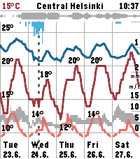

# Sää Weather Graph

Pebble watch app for viewing weather forecasts as a scrollable graph.

### Makefile

The project uses _Makefile_ to define common build routines.

### Weather data

Weather data is fetched from the Finnish Meteorological Institute's (FMI) open
data service for locations in Scandinavia, with
[Open-Meteo](https://open-meteo.com) as a fallback for other locations.

Displayed data includes temperature, precipitation, wind speed and direction,
cloud cover, UV index, relative humidity, and sun conditions (golden hour,
darkness, sunrise/sunset ticks).

### Configuration

The app is configurable via the Pebble phone app. Settings include displayed
data layers per zoom level, units, date/time format, and up to five preset
locations.
